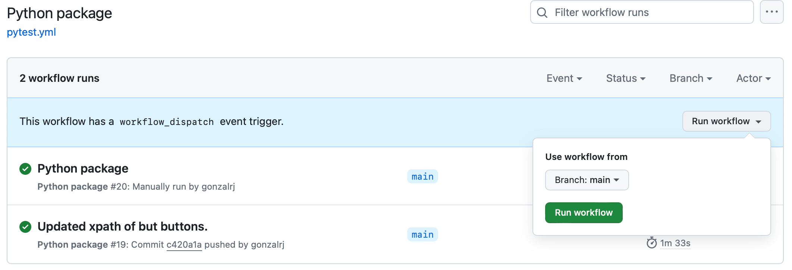

# planitDemo

The project is accessible via https://github.com/gonzalrj/planitDemo which is a public GitHub repository.

The code can be executed through the following steps:
1. Go to the workflow page: https://github.com/gonzalrj/planitDemo/actions/workflows/pytest.yml
2. Click on Run workflow dropdown then select Run workflow. 
3. Refresh the page to check the status of the test.

